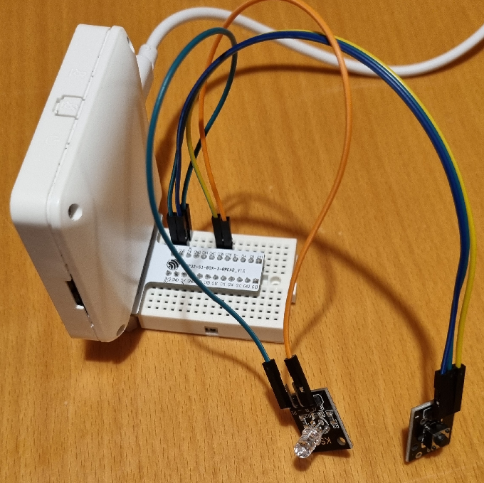

# Hardware setup

- [ESP32-S3-BOX-3](https://github.com/espressif/esp-box/blob/master/docs/getting_started.md)
- [ESP32-S3-BOX-3-BREAD](https://github.com/espressif/esp-box/blob/master/docs/hardware_overview/esp32_s3_box_3/hardware_overview_for_box_3.md#esp32-s3-box-3-bread)
- An LED module
- A button module

## Connections
- GPIO38 input from the button
- GPIO39 output for driving LED

