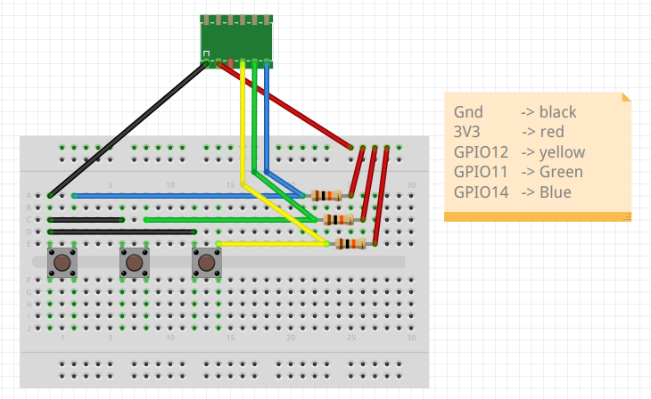
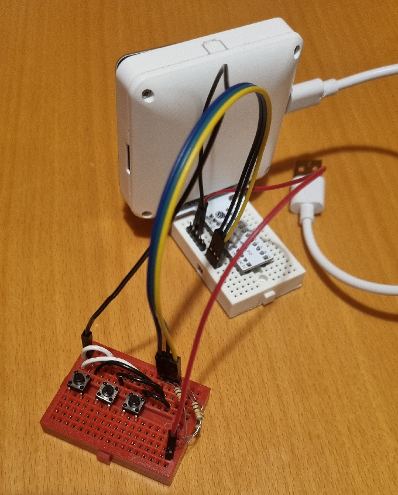

# Hardware setup

- [ESP32-S3-BOX-3](https://github.com/espressif/esp-box/blob/master/docs/getting_started.md)
- [ESP32-S3-BOX-3-BREAD](https://github.com/espressif/esp-box/blob/master/docs/hardware_overview/esp32_s3_box_3/hardware_overview_for_box_3.md#esp32-s3-box-3-bread)
- A custom-made button set as the devkit doesn't have physical buttons on it. The Fritzing diagram is below:

The button set has 3 buttons: left, middle, and right. Normal high with pull-up resistors (10kOhm).    

Image: Fritzing diagram of the button set (the same as in the audio example)   
   

## Connections
- GPIO12 Left button 
- GPIO11 Middle button 
- GPIO14 Right button 

   
Image: A photo of the hardware setup (the same as in the audio example)   
