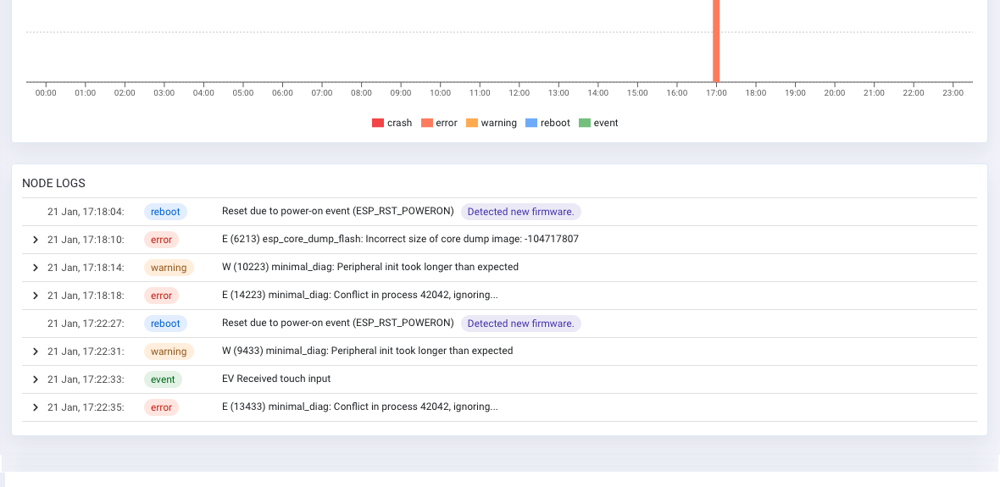
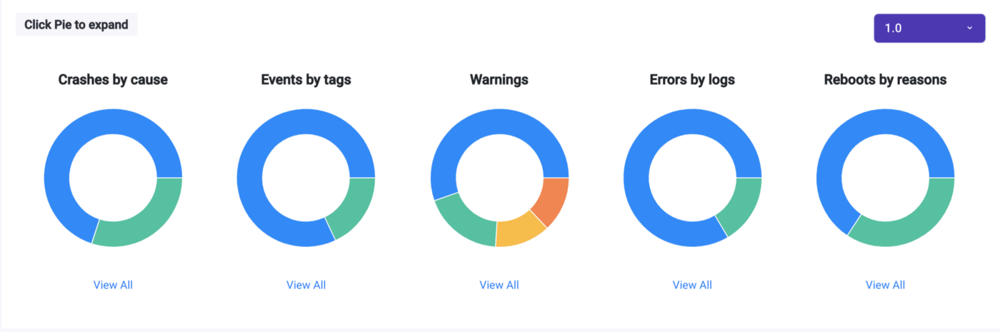
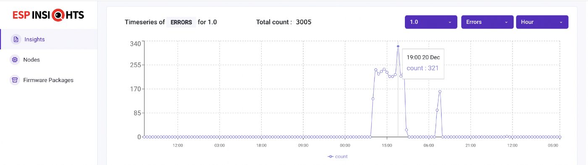
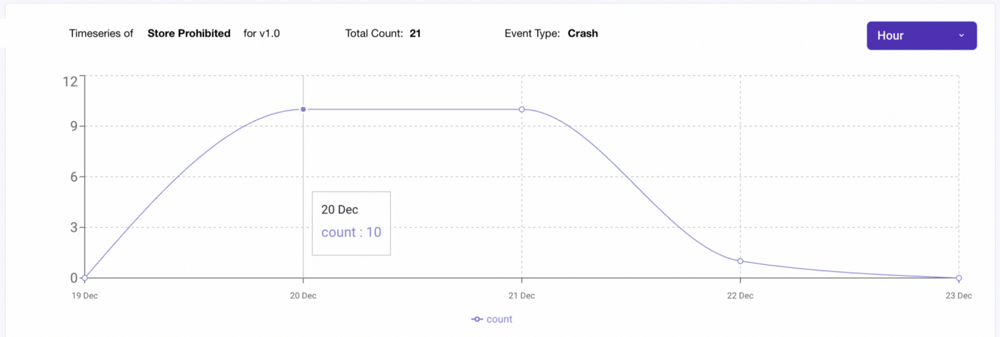
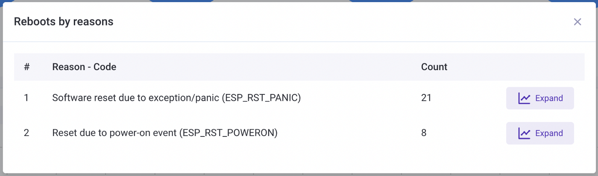
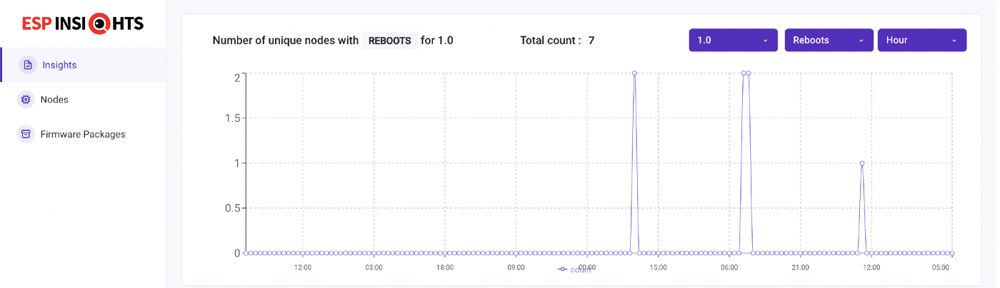

## Features
Below are some of the features offered by ESP Insights:
- [Core Dump](#core-dump)
- [Logs](#logs)
- [Reboot Reason](#reboot-reason)
- [Metrics](#metrics)
- [Variables](#variables)
- [Transport Sharing](#transport-sharing)
- [Optimising Device-Cloud Communication](#optimising-device-cloud-communication)
- [Group Analytics](#group-analytics)

### Core Dump
In case of a firmware crash, the Insights agent captures the core dump information into the flash memory and reports it to the ESP Insights cloud in the subsequent boot-up. This allows you to look at all the crash logs that the devices may be generating in the field.

The entire stack backtrace leading up to the crash is also captured and reported. To optimise the device-cloud communication, the firmware only sends a summary of the core dump. The summary contains the most useful contents of the core dump like the program counter, the exception cause, exception vaddress, general purpose registers, and the backtrace.


#### Configurations
The core dump reporting requires some configuration options to be set. The configuration options are in the below sdkconfig.defaults file can be added in your own application's SDK configuration using the following command:
```
cat <<EOF>> sdkconfig.defaults
CONFIG_ESP32_ENABLE_COREDUMP=y
CONFIG_ESP32_ENABLE_COREDUMP_TO_FLASH=y
CONFIG_ESP32_COREDUMP_DATA_FORMAT_ELF=y
CONFIG_ESP32_COREDUMP_CHECKSUM_CRC32=y
CONFIG_ESP32_CORE_DUMP_MAX_TASKS_NUM=64
EOF
```

Reconfigure the project using the following
```
rm sdkconfig
idf.py reconfigure
```

#### Partition Table
To store the core dump into flash, an additional coredump partition is required. Add the following line to your project's partitions.csv.
```
coredump, data, coredump, , 64K
```

### Logs
The `esp_log` is the default logging component in `esp-idf`. Typically `ESP_LOGE` and `ESP_LOGW` are used to log errors and warnings in the firmware. All the logs logged using the esp_log component are tracked by the Insights agent and reported to the ESP Insights cloud.
This allows you to view these errors through the ESP Insights Dashboard, providing you with detailed information about what may be going on.



*NOTE*: If you have multiple devices in the field, capturing every error and warning may generate large volumes of data that get reported to the cloud. We allow you mechanisms to fine-tune what of these logs can be reported to the Insights cloud.

#### Configure the log level
Users can configure the log level to report by using `esp_diag_log_hook_enable()` and `esp_diag_log_hook_disable()` APIs.
```
/* enable tracking error logs */
esp_diag_log_hook_enable(ESP_DIAG_LOG_TYPE_ERROR);

/* enable tracking all log levels */
esp_diag_log_hook_enable(ESP_DIAG_LOG_TYPE_ERROR | ESP_DIAG_LOG_TYPE_WARNING | ESP_DIAG_LOG_TYPE_EVENT);

/* disable tracking custom events */
esp_diag_log_hook_disable(ESP_DIAG_LOG_TYPE_EVENT);
```

#### Configure the log level for a specific tag
Users can configure the log level to for a specific tag by using
[`esp_log_level_set()`](https://docs.espressif.com/projects/esp-idf/en/latest/esp32/api-reference/system/log.html#_CPPv417esp_log_level_setPKc15esp_log_level_t) API.

Only logs with same and lower verbosity levels will be reported to cloud and shown on console.

```
/* This disables the errors, warnings, and events */
esp_log_level_set(TAG, ESP_LOG_NONE);

/* This enables errors, disable warnings and events */
esp_log_level_set(TAG, ESP_LOG_ERROR);

/* This enables errors and warnings, disables the events */
esp_log_level_set(TAG, ESP_LOG_WARN);

/* This enables errors, warning, and events */
esp_log_level_set(TAG, ESP_LOG_INFO);
```

#### Insights with Logging disabled
If _Default log verbosity_ is configured to _No output_ (Component config > Log output > Default log verbosity) then error and warning logs will not be visible on the dashboard.
Because log level check is during the preprocessing phase, this removes all the ESP_LOGE and ESP_LOGW from the binary. It also removes the diagnostics log hook inside the logging macro.
_Default log verbosity_ level does not affect the visibility of Diagnostics Events (ESP_DIAG_EVENT()) on the dashboard.

Workaround for the above problem is to set the _Channel for console output_ config option (Component config > ESP System Settings > Channel for console output) to _None_.
All the logs will be visible on the dashboard and no logs will appear on the console.
As Insights deals with only error and warning logs, you can set the _Default log verbosity_ to _Warning_ which reduces the application binary size by removing logs with a level greater than _Warning_.

#### Maintaining Logs Across Reboots
Often it happens that a crash is preceded by certain error conditions that trigger the crash. It would be invaluable if we could extract these errors that occurred just before a crash happened, to understand the particulars of the crash. ESP Insights provides a way to capture this.

Most ESP32 SoCs are equipped with an RTC memory that is retained across a soft power cycle event. The Insights agent uses this memory to store the critical errors that occurred in the system. On any boot-up, the Insights agent will check for any unreported errors from the previous boot-up through this RTC memory and report that to the Insights cloud.

### Reboot Reason
The Insights agent reports the reboot reason on every boot-up to the cloud. This allows you to identify whether a device rebooted because of a crash, a watchdog trigger, a soft reset, or a power-reset by the end-user.

### Metrics
The Insights agent supports recording and reporting metrics to the cloud. You may then view  graphs, through the Insights dashboard, that plot how these metrics changed over a period of time.

You should enable `CONFIG_DIAG_ENABLE_METRICS=y` config option to enable metrics support.

The Insights agent can record a set of pre-defined system metrics. Additionally, you could also add your own custom metrics.


#### Heap Metrics
The Insights agent has implemented heap metrics collection and reports free memory, largest free block, and minimum free memory ever. These parameters are tracked and reported for heap in the internal RAM as well as for the heap in the external RAM (in case the device has the PSRAM). It also records failed memory allocations. Note that recording failed allocation is available from esp-idf release/v4.2 and onwards.

Enable `CONFIG_DIAG_ENABLE_HEAP_METRICS=y` config option to enable heap metrics.

#### Wi-Fi Metrics
The ESP Insights agent also supports Wi-Fi metrics. It collects Wi-Fi signal strength (RSSI) and minimum ever Wi-Fi signal strength information. RSSI is sampled every 30 seconds and if it crosses configured step interval(eg: 5dB, values in multiples of 5, -5dB, -10dB, -15dB, etc.) in either direction then it gets reported to cloud. From esp-idf v4.3 onwards the minimum ever RSSI is also collected and recorded when the RSSI value drops below a pre-configured threshold. The threshold can be configured using [esp_wifi_set_rssi_threshold()](https://docs.espressif.com/projects/esp-idf/en/latest/esp32/api-reference/network/esp_wifi.html?highlight=esp_wifi#_CPPv427esp_wifi_set_rssi_threshold7int32_t) API.

There is also an API to collect and report wifi metrics at any given point in time.
```
/* Reports RSSI to cloud and also prints to console */
esp_diag_wifi_metrics_dump();
```

#### Custom Metrics
It is fairly simple to register your own metrics as well. This can be done as: 

```
/* Register a metrics to track room temperature */
esp_diag_metrics_register("temp", "temp1", "Room temperature", "room", ESP_DIAG_DATA_TYPE_UINT);

/* Record a data point for room temperature */
uint32_t room_temp = get_room_temperature();
esp_diag_metrics_add_uint("temp1", room_temp);
```

As you may notice, every metric has some metadata associated with it. Some explanations of these fields:
- "temp" - Tag is for grouping similar metrics together
- "temp1" - A unique key identifying the metric
- "Temperature" - The label that is shown on the dashboard
- "Home.Kitchen" - Hierarchical path to group metrics for easy navigation on the dashboard
- ESP_DIAG_DATA_TYPE_UINT - Data type

### Variables
Diagnostics variables are similar to metrics but they represent entities where their _current_ value is much more important than over a period of time. For example, the IP address of the device.

You should enable `CONFIG_DIAG_ENABLE_VARIABLES=y` config option to enable variables support in firmware.

The Insights agent can record a set of pre-defined system variables. Additionally, you could also add your own custom variables.


#### Network Variables
The Insights module currently records some of the following network variables.

* For Wi-Fi: SSID, BSSID, Channel, Authentication mode, and wifi disconnection reason
* For IP: IP address, gateway, and netmask parameters

You should enable `CONFIG_DIAG_ENABLE_NETWORK_VARIABLES` config option to enable network variables.


#### Custom Variables
It is fairly simple to register your own variables as well. This can be done as:

```
/* Register a variable to track stations associated with ESP32 AP */
esp_diag_variable_register("wifi", "sta_cnt", "STAs associated", "wifi.sta", ESP_DIAG_DATA_TYPE_UINT);

/* Assuming WIFI_EVENT_AP_STACONNECTED and WIFI_EVENT_AP_STADISCONNECTED events track the number of associated stations */
esp_diag_variable_add_uint("sta_cnt", sta_cnt);
```

As you may notice, every variable has some metadata associated with it. Some explanations of these fields:
- "wifi" - Tag is for grouping similar variables together
- "sta_cnt" - A unique key identifying the variable
- "STAs associated" - The label that should be shown on the Insights dashboard
- "wifi.sta" - Hierarchical path to group variables for easy navigation on the dashboard
- ESP_DIAG_DATA_TYPE_UINT - Data type

### Transport Sharing
The Insights agent supports sending data to the cloud using HTTPS or MQTT (TLS) transport.

Creating a separate TLS session on the device could add to the memory consumption on the device. 
To avoid this, the Insights agent shares the transport (MQTT) with your cloud agent.
Currently the RainMaker cloud agent is supported.
This ensures that we reuse the socket/TLS connection without adding a connection memory overhead on your device.

[Click here](https://github.com/espressif/esp-rainmaker/blob/master/examples/common/app_insights/app_insights.c) to check how Insights uses RainMaker's transport to send data.

### Optimising Device-Cloud Communication
The diagnostics data transfer between the device and the cloud is optimised to send as little data as possible. Some of the things that we do to ensure this are:
* We use CBOR based encoding, which provides a tight binary representation of data to be transported between the device and the cloud
* Wherever possible, we leverage the fact that the cloud can reference the ELF file for the firmware that is executing on the device. For example, if the firmware logs a read-only string data in diagnostics, this read-only string would already be present in the `rodata` of the firmware ELF image. So instead of transmitting the entire string, we just transmit the address of the string to the Insights cloud. The Insights cloud takes care of cross-referencing this with the appropriate ELF file to extract the string that is available.
* Many cloud platforms charge based on the MQTT messages. One of the features we are working on is to piggyback diagnostics data into the same MQTT message as the command-and-control data from your cloud service. This will bring further costs savings by optimising the number of distinct MQTT messages being exchanged with the cloud.

### Group Analytics
ESP Insights provides insights into how group of devices are performing.
You may group devices based on the Project, Project Versions or Event categories.

- Compare the firmware insights across different versions of a project
- A very high-level insights starting at a project level and can be drilled down to an event category



A few examples of group based data that you can observe:

- Counts grouped by events (for e.g., Errors) for a particular project and version, in a selected time interval.
You can change the interval to hour or aggregate to week or a month interval.



- Distribution of event counts (for e.g., crash counts) for a group in a selected time interval.



- Distribution of event (for e.g. Reboot reason) counts for a group in a selected time interval. You can drill down further on the reboot reason and get to the nodes which are reporting the particular event.



- Count of unique nodes which are reporting certain events (reboots / errors / warnings) in a selected time interval



- List of top nodes having the most number of events and can be drilled down to category level
